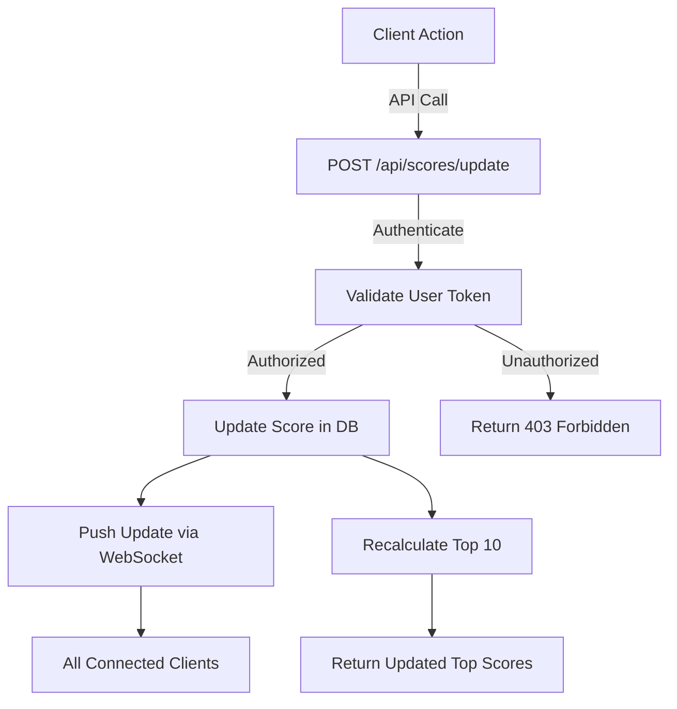

# Scoreboard API Module Documentation

## Overview

This module handles the backend functionality for managing and updating the scoreboard for a website. It ensures secure score updates, prevents unauthorized modifications, and provides real-time updates for the top 10 users' scores.

---

## Features

1. **Top 10 Users Retrieval**

   - Retrieve the top 10 users with the highest scores for display on the scoreboard.

2. **Score Update API**

   - Securely update a user’s score upon completion of an action.

3. **Real-Time Updates**

   - Push live updates to all connected clients when the scoreboard changes.

4. **Authorization & Validation**
   - Prevent malicious users from modifying scores without proper authorization.

---

## API Endpoints

### 1. **Get Top Scores**

- **Endpoint**: `GET /api/scores`
- **Description**: Retrieve the top 10 users with the highest scores.
- **Request**
  - Headers: `Authorization: Bearer <token>`
- **Response**
  - `200 OK`
    ```json
    [
        { "username": "user1", "score": 500 },
        { "username": "user2", "score": 450 },
        { "username": "user3", "score": 400 },
        ...
    ]
    ```
- **Error Responses**
  - `401 Unauthorized`: Invalid or missing authentication token.
  - `500 Internal Server Error`: Unexpected server error.

### 2. **Update Score**

- **Endpoint** `POST /api/scores/update/1234`
- **Description**: Securely update a user’s score.
- **Request**
  - Headers: `Authorization: Bearer <token>`
  - Body:
    ```json
    {
      "increment": 50
    }
    ```
- **Response**
  - `200 OK`:
    ```json
    { "message": "Score updated successfully" }
    ```
- **Error Responses**
  - `401 Unauthorized`: Invalid or missing authentication token.
  - `403 Forbidden`: Unauthorized attempt to modify score.
  - `400 Bad Request`: Invalid input data.
  - `500 Internal Server Error`: Unexpected server error.

### 3. **Real-Time Scoreboard Updates**

- **WebSocket Endpoint**: `ws://<server-url>/scores/live`
- **Description**: Push live updates to connected clients when the scoreboard changes.
- **Data Format**:
  ```json
  {
    "username": "user1",
    "score": 520,
    "rank": 1
  }
  ```

---

## Execution Flow Diagram



---

## Security Measures

1. **Token-Based Authentication**

   - Use JWT for authenticating API requests.
   - Ensure tokens are validated on every request.

2. **Rate Limiting**

   - Prevent abuse by limiting the number of API calls per user within a given timeframe.

3. **Input Validation**

   - Validate all incoming requests to ensure proper data types and values.
   - Reject invalid or incomplete payloads with `400 Bad Request`.

4. **Server-Side Authorization**

   - Verify the requesting user has permission to modify the score.
   - Maintain audit logs for all score updates.

5. **WebSocket Security**

   - Authenticate WebSocket connections using a token during the handshake.
   - Disconnect clients with invalid tokens.

6. **Audit Logs**

- Record every score update with details such as user ID, timestamp, and action source for monitoring and debugging purposes.

---

## Suggestions for Improvement

1. **Caching**

   - Use an in-memory store like Redis to cache the top 10 scores for faster retrieval.

2. **Scalability**

   - Implement horizontal scaling for the WebSocket server to handle high concurrency.

3. **Monitoring**

   - Integrate monitoring tools (e.g., Prometheus, Grafana) to track API usage and performance.

4. **Audit Trail**

   - Log every score update with details (user ID, timestamp, and increment value) for future analysis and security audits.

5. **Leaderboard Pagination**

   - Allow the client to request paginated leaderboards for better user experience when viewing more than the top 10 scores.

6. **Token Security**

   - Rotate JWT secret keys periodically to reduce risks. Set token expiration to minimize the impact of token theft.

7. **Data Integrity**

   - Hash sensitive data (e.g., userId) before storing it in logs.

8. **Rate Limiting**
   - Implement rate limiting using libraries like express-rate-limit to prevent API abuse.

---

## Implementation Checklist

1. **Backend Tasks**
   - Create middleware for token validation.
   - Implement GET /api/scores with caching for the top 10 users.
   - Implement POST /api/scores/update with validation and database transactions.
   - Set up WebSocket broadcasting using Socket.IO.
2. **Testing Tasks**
   - Unit tests for individual API endpoints.
   - Integration tests for database updates.
   - Load testing for WebSocket scalability.
3. **Deployment Tasks**
   - Set up environment variables for database credentials and JWT secret.
   - Deploy the application with Docker or similar tools for consistent environments.

## **Technologies**

- **Node.js**: Backend runtime.
- **Express**: Web framework for building APIs.
- **Socket.IO**: Real-time communication for WebSocket updates.
- **Prisma/Sequelize**: ORM for database interaction.
- **PostgreSQL**: Database for persisting user scores.

## **Database Schema**

```sql
CREATE TABLE users (
    id SERIAL PRIMARY KEY,
    username VARCHAR(50) UNIQUE NOT NULL,
    score INT DEFAULT 0 NOT NULL,
    created_at TIMESTAMP DEFAULT CURRENT_TIMESTAMP
);

CREATE INDEX idx_scores ON users (score DESC);
```

## **Expanded Middleware**

1.  **Authentication Middleware**

- Decode and validate JWT tokens.
- Reject requests with invalid or expired tokens.

2. **Rate Limiting Middleware**

- Track API usage by user IP or token.
- Limit requests per minute to prevent abuse.

3. **Validation Middleware**

- Use a library like Joi or Zod to validate request payloads.

4.  **Example Express Middleware**

```
import jwt from 'jsonwebtoken';
import rateLimit from 'express-rate-limit';
import { Request, Response, NextFunction } from 'express';

// Authentication Middleware
export const authenticate = (req: Request, res: Response, next: NextFunction) => {
 const token = req.headers.authorization?.split(' ')[1];
 if (!token) return res.status(401).json({ message: 'Unauthorized' });

 try {
     const user = jwt.verify(token, process.env.JWT_SECRET!);
     req.user = user;
     next();
 } catch (err) {
     res.status(401).json({ message: 'Invalid or expired token' });
 }
};

// Rate Limiting Middleware
export const limiter = rateLimit({
 windowMs: 1 * 60 * 1000, // 1 minute
 max: 100, // limit each IP to 100 requests per windowMs
 message: { message: 'Too many requests, please try again later.' },
});
```

## Ensure increment is a positive integer and within predefined limits.
